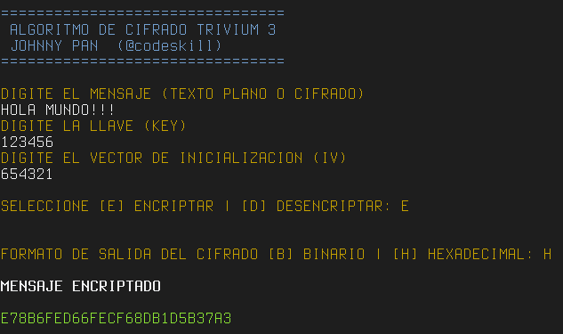

# Trivium

Implementación del algoritmo de cifrado **Trivium** utilizando Python.


# Algoritmo Trivium

Trivium es un algoritmo de encriptación simétrica creado por Christophe De Cannière and Bart Preneel para el proyecto `eSTREAM` el cual se llevó a cabo entre los años 2004 y 2008. Este algoritmo está diseñado especialmente para ser implementado fácilmente en hardware, es altamente paralelizable y de licencia libre.

Este algoritmo de cifrado es de tipo `Stream Cipher`, esto quiere decir que es capaz de generar un `keystream` de tamaño 2<sup>64</sup> bits a partir de una llave privada de 80 bits y de un vector inicial de 80 bits. El algoritmo de cifrado se divide en dos partes; la inicialización del estado interno y la generación del keystream. El estado interno está formado por 288 bits.


El proceso de inicialización del estado interno **S** consiste en los siguientes pasos:

- Se copia la llave secreta **K** a las primeras 80 localidades del estado interno y se asigna cero a las localidades de 81 a 93: 
(S<sub>1</sub>,S<sub>2</sub>,S<sub>3</sub>, ... , S<sub>93</sub>) &#8592; (K<sub>1</sub>,K<sub>2</sub>, ... ,K<sub>80</sub>,0, ... ,0).

- Se copia el vector inicial **IV** a las localidades 94 a 173 del estado interno y se asigna cero a las localidades de 174 a 177: 
(S<sub>94</sub>,S<sub>95</sub>,S<sub>96</sub>, ... , S<sub>177</sub>) &#8592; (IV<sub>1</sub>,IV<sub>2</sub>, ... ,IV<sub>80</sub>,0, ... ,0).

- Se asigna cero a las localidades 178 a 285 y uno a las localidades 286 a 288 del estado interno:
(S<sub>178</sub>,S<sub>179</sub>,S<sub>180</sub>, ... , S<sub>288</sub>) &#8592; (0, ... ,0,1,1,1).

El proceso de generación de llave se hace una vez inicializado el estado interno **S**, donde la operación `a + b` equivale
a la operación lógica **OR**, y la operación `a ∙ b` equivale a la operación lógica **AND**.

Al finalizar cada iteración, se obtiene el bit del `keystream` al cual se le aplica la operación lógica **OR-Exclusiva** para el cifrado del texto.

Posteriormente se ejecuta el proceso de generación del `keystream` 1152 veces y se descartan los bits generados, una vez finalizado el proceso el estado interno ya se
encuentra listo para generar información válida.

# Uso con Python 2

```shell
python2 trivium2.py
```

# Uso con Python 3

```shell
python3 trivium3.py
```
# Demo



